# Heavy Rental — Project Documentation

**Audience:** project submission (examiners, new team members).  
**Scope:** as-built behavior of all Heavy Rental Git repositories. Design-only items are called out in [§13](#13-design-only-and-known-gaps).  
**Diagrams:** Mermaid (renders on GitHub) and PlantUML (fences plus [`docs/diagrams/`](docs/diagrams/)).  
**Living contracts:** [`openspec/`](openspec/) and [`repositories/`](repositories/).

| Item | Value |
|------|--------|
| Organization | [github.com/Heavy-Rental](https://github.com/Heavy-Rental) |
| Documentation repo | [Heavy-Rental-Project-Documentation](https://github.com/Heavy-Rental/Heavy-Rental-Project-Documentation) |
| Local setup | [`QUICKSTART.md`](QUICKSTART.md) |
| Spec process | [`docs/spec-governance.md`](docs/spec-governance.md) |
| Default branches | Product/supporting repos: `develop`. This pack: `master` |

---

## Table of contents

1. [Purpose and how to read](#1-purpose-and-how-to-read)
2. [Problem and goals](#2-problem-and-goals)
3. [Repository map](#3-repository-map)
4. [Actors and roles](#4-actors-and-roles)
5. [Feature catalog](#5-feature-catalog)
6. [System architecture](#6-system-architecture)
7. [Use case diagrams](#7-use-case-diagrams)
8. [Sequence diagrams](#8-sequence-diagrams)
9. [Entity-relationship diagram](#9-entity-relationship-diagram)
10. [Class diagrams](#10-class-diagrams)
11. [State machines](#11-state-machines)
12. [Activity and deployment](#12-activity-and-deployment)
13. [Design-only and known gaps](#13-design-only-and-known-gaps)
14. [Traceability](#14-traceability)

---

## 1. Purpose and how to read

Heavy Rental is a **heavy-equipment hire** platform: catalog, rental plans, bookings, Stripe deposits, field mobilisation/returns, and an AI recommender that turns a project specification into an equipment quote.

This file is the **single submission document**. Per-repository OpenSpec, OpenSPDD, and ADR live under [`repositories/`](repositories/). Product source of truth for HTTP remains the Spring and Haystack `openspec/` trees in those repos; this pack **synthesizes** as-built behavior for submission.

| If you need… | Read |
|--------------|------|
| Run locally | [`QUICKSTART.md`](QUICKSTART.md) |
| Why a decision exists | [`adr/`](adr/) and `repositories/<repo>/adr/` |
| Testable behavior | `repositories/<repo>/openspec/specs/` |
| Implementation contract | `repositories/<repo>/spdd/prompt/` |

---

## 2. Problem and goals

Construction firms rent excavators, boom lifts, scissors lifts, and fork lifts. Manual matching of project needs to fleet is slow; availability is easy to get wrong; deposits and field ops are easy to desynchronise.

| Goal | How the platform addresses it |
|------|-------------------------------|
| Browse real fleet | Spring `GET /api/equipment` with optional date-window availability |
| Quote a plan | Spring-only `baseDailyRate × inclusive days` on rental plans |
| Book and take deposit | Booking at **30%** deposit; Stripe PaymentIntent + webhook |
| Field ops | Android + REST: `CONFIRMED → MOBILISED → COMPLETED` |
| Project-spec → equipment | Portal → Spring JWT → Haystack Call 1 ingest + Call 2 quote |
| Follow-up Q&A | Call 3 on the same session; no re-ingest |
| Admin visibility | Users CRUD; trailing six-month utilisation and revenue |
| Safe AI sandbox | Haystack pull-mirrors OLTP; never writes the primary |

Approved catalog types: **Boom Lift, Scissors Lift, Fork Lift, Excavator**.

---

## 3. Repository map

### 3.1 Product

| Repository | Role | Stack | Default port |
|------------|------|--------|----------------|
| [heavy-rental-mobile](https://github.com/Heavy-Rental/heavy-rental-mobile) | Android ops + read-only customer bookings | Kotlin, Compose, Retrofit, OpenAPI mocks | Emulator → host `8080` |
| [heavy-rental-spring-rest-api](https://github.com/Heavy-Rental/heavy-rental-spring-rest-api) | Auth, CRUD, bookings, Stripe, Haystack saga | Java 21, Spring Boot 4.1, PostgreSQL, JWT HS256 | `8080` |
| [heavy-rental-react-web-portal](https://github.com/Heavy-Rental/heavy-rental-react-web-portal) | Public catalog, customer checkout, admin/employee dashboards | React 19, TS, Vite 8, Tailwind v4 | `5173` |
| [haystack-fast-api](https://github.com/Heavy-Rental/haystack-fast-api) | Internal recommender (Call 1/2/3), fleet mirror consumer | Python 3.12, FastAPI, Haystack, uv | `8000` |

### 3.2 Supporting

| Repository | Role |
|------------|------|
| [heavy-rental-devcontainer-configuration](https://github.com/Heavy-Rental/heavy-rental-devcontainer-configuration) | Three independent Compose packs on external network `heavy-rental-network` |
| [heavy-rental-project-pipeline-development](https://github.com/Heavy-Rental/heavy-rental-project-pipeline-development) | GitHub Actions: fast-feedback, CI, release images, Academy CD callers |
| [heavy-rental-project-instructure-and-cloud-deploy](https://github.com/Heavy-Rental/heavy-rental-project-instructure-and-cloud-deploy) | Terraform estate (VPC, NAT GW, ASG, ALB, RDS, NLB) + Ansible guest configure |

### 3.3 Context (Mermaid)

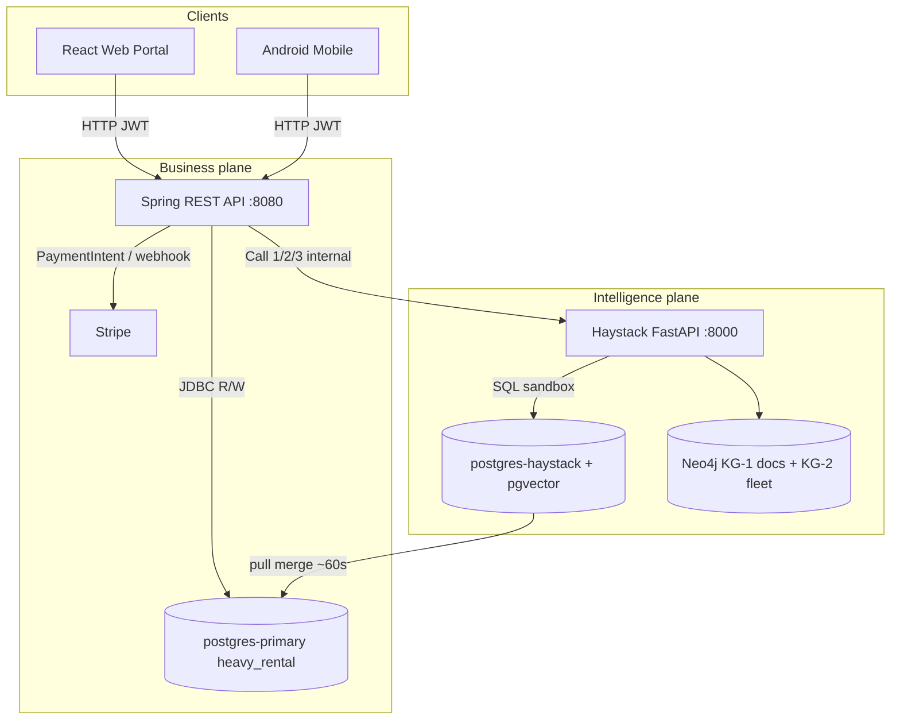

PlantUML: [`docs/diagrams/context.puml`](docs/diagrams/context.puml).

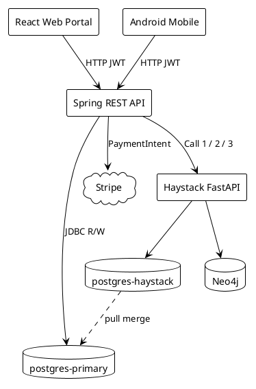

---

## 4. Actors and roles

| Actor | JWT / app role | Surfaces |
|-------|----------------|----------|
| **Customer** | `ROLE_USER` | Portal: browse, plan, checkout, project-spec; Mobile: read-only own bookings |
| **Admin** | `ROLE_ADMIN` | Portal admin dashboard; REST `/api/users`, `/api/monthly-utilization`; Mobile staff screens |
| **Driver / operator** | `ROLE_DRIVER` (seed) / staff routing | Mobile: today’s deliveries and returns |
| **Stripe** | Webhook signature (no JWT) | `POST /api/payments/webhook` |
| **Haystack** | Internal HTTP from Spring only | Call 1 ingest, Call 2 quote, Call 3 Q&A |

Auth handshake is shared: **interim JWT** (`GET /api/auth/getBearerToken`) then **access JWT** (`POST /api/auth/login`). Staff vs customer landing screen is decided client-side from the access token `roles` claim.

---

## 5. Feature catalog

### 5.1 Android mobile (`heavy-rental-mobile`)

| Area | As-built |
|------|----------|
| Auth | Interim → access JWT; in-memory session |
| Home | Today’s delivery and return counts by status |
| Deliveries | Today’s list (`startDate == today`, `CONFIRMED`/`MOBILISED`); maps; mobilise |
| Returns | Today’s list (`endDate == today`, `MOBILISED`/`COMPLETED`); complete |
| Customer bookings | Read-only `GET /api/bookings` for `ROLE_USER` |
| Offline | Seed `MockDataRepository` + optimistic PATCH; error banner |
| Mocks | OpenAPI → Mockoon/Prism on `:8081` |

Out of scope (v1): MFA, Room offline queue, historical analytics, signatures/photos.

### 5.2 Spring REST API

| Domain | Highlights |
|--------|------------|
| Auth | Interim mint, login (denylist interim `jti`), logout (denylist access `jti`) |
| Equipment | List/filter/CRUD; JPEG data-URI images; availability vs **ACTIVE** bookings |
| Depots | `GET /api/depots` → `[]` stub |
| Rental plans | One active DRAFT/SAVED/QUOTED plan per customer; Spring-only quote |
| Bookings | Create `PENDING_DEPOSIT`; 30% deposit; overlap → 409; postal code on `siteAddress` |
| Payments | Deposit PaymentIntent (`sgd`, `setup_future_usage=off_session`); webhook; 02:00 SGT balance scheduler |
| Deliveries / returns | `CONFIRMED→MOBILISED`, `MOBILISED→COMPLETED` |
| Recommender | Dual-hop Call 1+2; Call 3 Q&A; GET session is DB-only |
| Admin | Users CRUD (temp password on create); monthly utilisation |

Layering: thin controllers → services → JPA. Controllers never call Haystack HTTP.

### 5.3 React web portal

| Area | As-built |
|------|----------|
| Public portal | Catalog, search/filter, hero, stats, testimonials |
| Customer | Onboarding, calendar booking, cart, checkout, profile, rental plans |
| Admin | Fleet, assets, bookings, pricing, analytics (Recharts) |
| Employee | Operational overview |
| Pages | Safety, About, Projects |
| Assistant | Project-spec → Spring `/api/recommendations/project-spec` (not a browser→Haystack call) |
| Modes | `npm run dev:mock` (4010) vs `dev:api` (Spring 8080) |

### 5.4 Haystack FastAPI

| Call | Path | Result |
|------|------|--------|
| Health | `GET /health` | Liveness |
| Call 1 | `POST /internal/v1/recommendations/submitprojectspecification` | `ingest_id`, needs summary, budget, warnings |
| Call 2 | `POST /internal/v1/recommendations/project-knowledge/getassetrecommendations` | Quote `items[]` (no chatbot `answer`) |
| Call 3 | `POST /internal/v1/recommendations/project-knowledge/query` | `answer`, `sourcesUsed` |

Hard rules: never invent fleet ids or rates; live SQL `equipment.id` = `assets.id`; missing asset row is **omitted**; Call 2 without Call 1 on the **same process** → 404.

### 5.5 DevContainers, pipeline, infra

| Repo | Features |
|------|----------|
| DevContainer config | External `heavy-rental-network`; dual REST packs; Haystack merge-sync + pgvector + Neo4j populate; portal pack with no local DB |
| Pipeline | Fast-feedback + full CI + release per app (mobile, REST, portal); Academy CD callers |
| Infra | Two-AZ Academy estate: public ALB → portal ASG → internal REST ALB → Haystack ALB; Multi-AZ RDS ×2; Bolt NLB; Terraform creates, Ansible configures |

---

## 6. System architecture

### 6.1 Trust and write ownership

| Store | Writer |
|-------|--------|
| `postgres-primary` | Spring REST **only** |
| `postgres-haystack` | Haystack app + merge-sync upserts |
| Neo4j KG-1 (`:Document`) | Haystack ingest; **never** dropped by populate |
| Neo4j KG-2 (`:Asset` `:Booking` `:Category`) | `neo4j-populate` |
| Stripe | PaymentIntents from Spring; status via webhook |

Portal and mobile **never** receive Haystack or Stripe secret credentials for server-side charges.

### 6.2 Local DevContainer topology

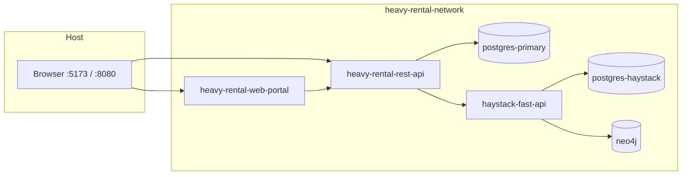

Bring-up order: network → REST → Haystack → Portal. Details: [`QUICKSTART.md`](QUICKSTART.md).

### 6.3 Haystack proxy map (Spring)

| Spring route | Haystack? |
|--------------|-----------|
| `POST /api/recommendations/project-spec` | Yes — Call 1 then Call 2 |
| `POST /api/recommendations/{id}/knowledge-query` | Yes — Call 3 only |
| `GET /api/recommendations/{id}` | No — DB session |
| `POST /api/rentalPlans/{id}/quote` | No — Spring arithmetic |
| Bookings, payments, equipment, users | No |

---

## 7. Use case diagrams

### 7.1 System-wide (Mermaid)

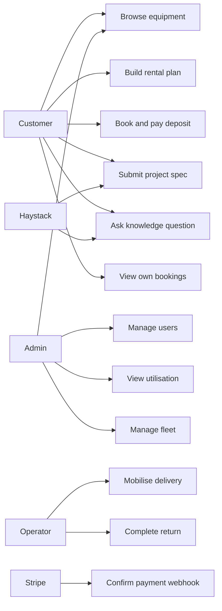

### 7.2 System-wide (PlantUML)

Source: [`docs/diagrams/usecase-system.puml`](docs/diagrams/usecase-system.puml).

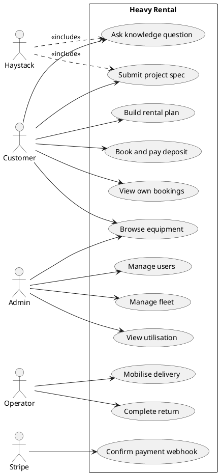

### 7.3 Portal customer vs mobile operator

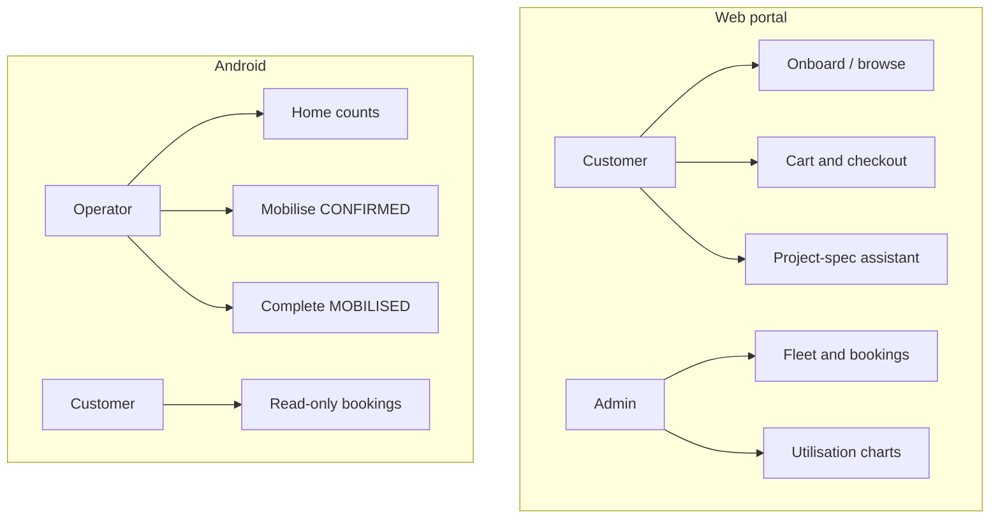

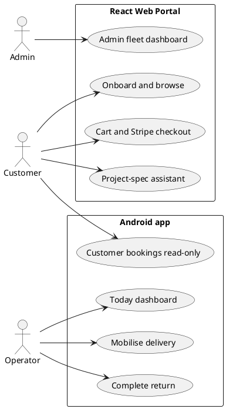

---

## 8. Sequence diagrams

### 8.1 Authentication

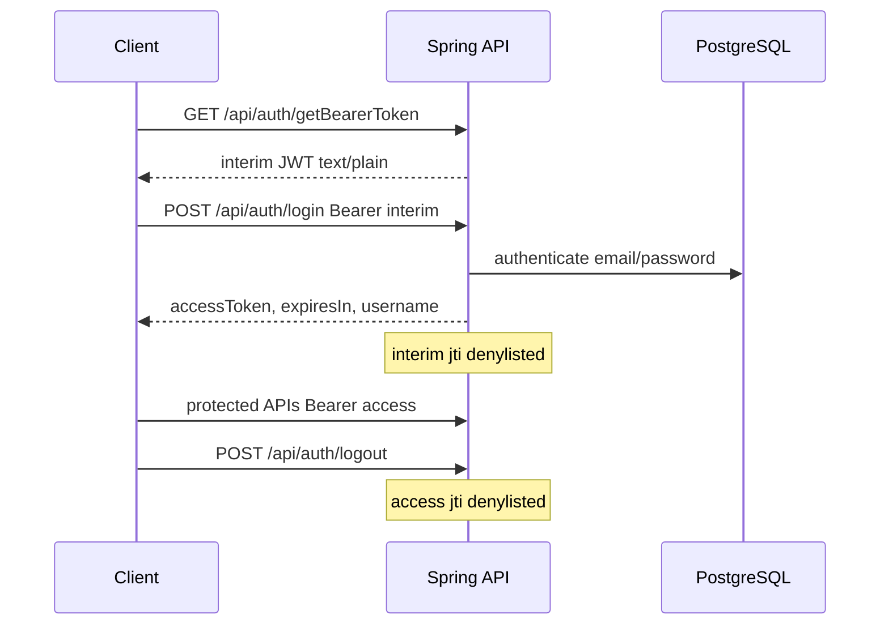

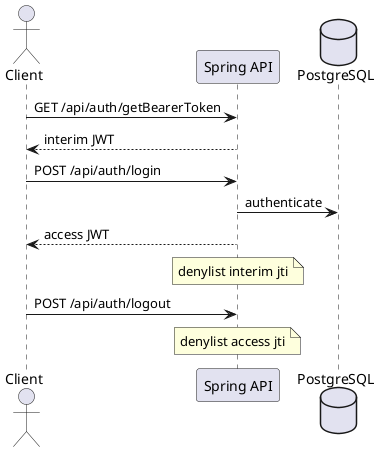

### 8.2 Rental plan quote (Spring-only)

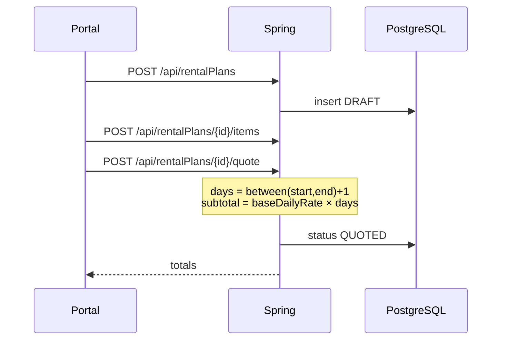

**Note:** Booking day count uses `ChronoUnit.DAYS.between` with minimum 1 (not inclusive `+1`). Treat plan quote and booking as separate conventions.

### 8.3 Booking, deposit, webhook, balance

```mermaid
sequenceDiagram
  participant P as Portal
  participant S as Spring
  participant Stripe
  participant DB as PostgreSQL
  P->>S: POST /api/bookings
  S->>DB: PENDING_DEPOSIT deposit=30%
  P->>S: POST /api/payments/deposit-intent
  S->>Stripe: PaymentIntent sgd off_session
  Stripe-->>P: clientSecret via Spring
  P->>Stripe: confirm payment
  Stripe->>S: POST /api/payments/webhook
  S->>DB: Payment SUCCESS; booking advances
  Note over S: Daily 02:00 Asia/Singapore<br/>off-session balance if startDate is tomorrow
```

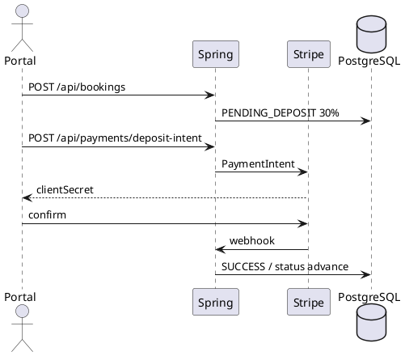

### 8.4 AI recommender dual-hop

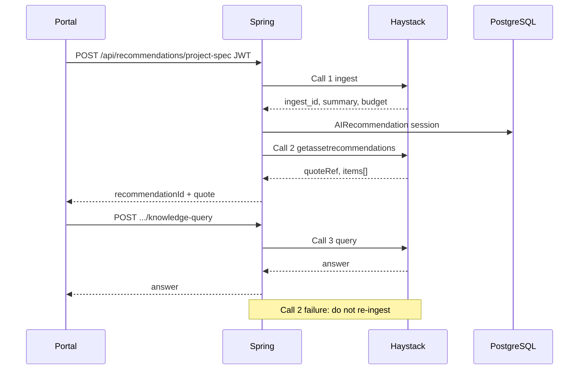

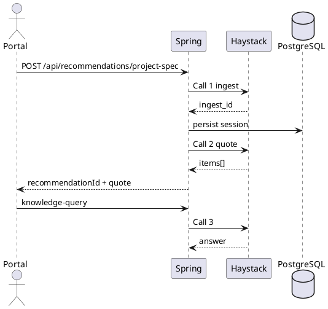

### 8.5 Delivery and return

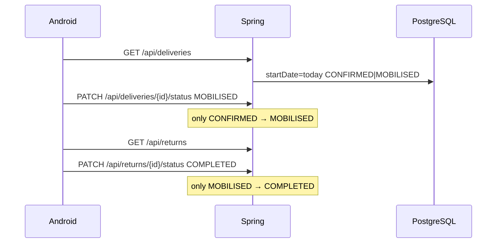

### 8.6 Fleet pull-merge

```mermaid
sequenceDiagram
  participant Spring
  participant Pri as postgres-primary
  participant Sync as postgres-haystack-sync
  participant Loc as postgres-haystack
  participant Pop as neo4j-populate
  participant N as Neo4j
  Spring->>Pri: write assets / bookings
  loop every ~60s
    Sync->>Pri: read allowlist
    alt primary up
      Sync->>Loc: upsert
      Sync->>Pop: POST /v1/populate
      Pop->>N: MERGE :Asset :Booking :Category
    else primary down
      Note over Sync: skip cycle; keep local
    end
  end
```

### 8.7 Cloud request path

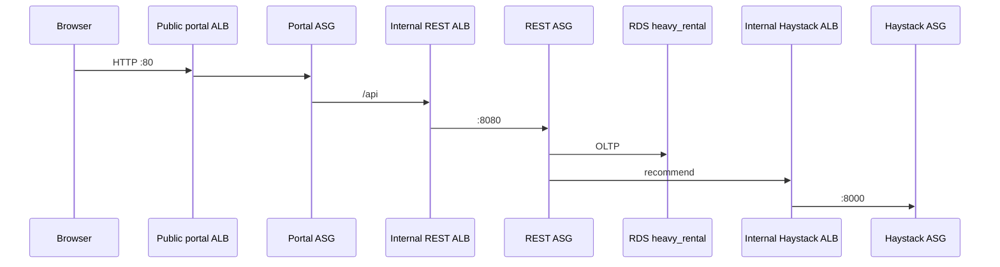

---

## 9. Entity-relationship diagram

As-built Spring JPA (physical tables in parentheses). `Booking.sitePostalCode` is a derived `@Formula` (trailing 6 digits of `siteAddress`).

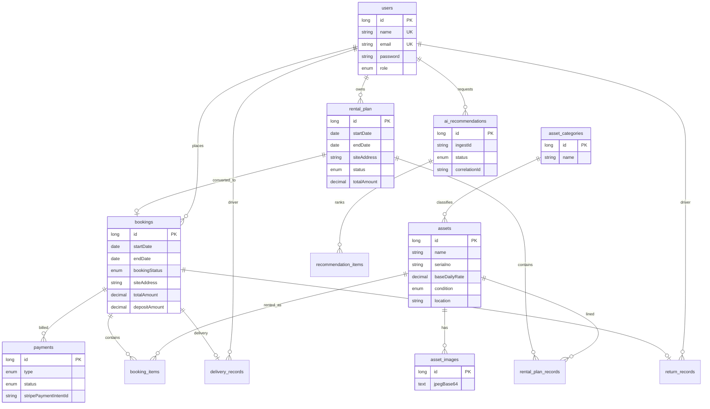

PlantUML: [`docs/diagrams/erd.puml`](docs/diagrams/erd.puml).

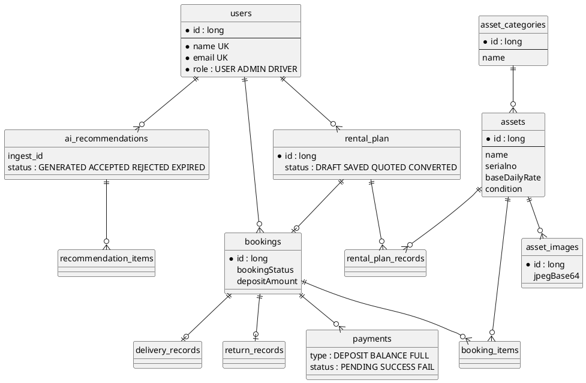

### Enumerations

| Enum | Values |
|------|--------|
| `User.UserRole` | `USER`, `ADMIN`, `DRIVER` |
| `ConditionType` | `EXCELLENT`, `GOOD`, `FAIR`, `NEEDS_REPAIR` |
| `RentalPlan.PlanStatus` | `DRAFT`, `SAVED`, `QUOTED`, `CONVERTED` |
| `Booking.BookingStatus` | `PENDING_DEPOSIT`, `PENDING_CONFIRMED`, `CONFIRMED`, `MOBILISED`, `COMPLETED`, `CANCELLED` |
| `Payment.PaymentType` | `DEPOSIT`, `BALANCE`, `FULL_PAYMENT` |
| `Payment.PaymentStatus` | `PENDING`, `SUCCESS`, `FAIL` |
| `AIRecommendation.RecommendationStatus` | `GENERATED`, `ACCEPTED`, `REJECTED`, `EXPIRED` |

**ACTIVE_STATUSES** (block overlap): `PENDING_DEPOSIT`, `PENDING_CONFIRMED`, `CONFIRMED`, `MOBILISED`.  
**UTILIZATION_STATUSES**: `CONFIRMED`, `MOBILISED`, `COMPLETED`.

---

## 10. Class diagrams

### 10.1 Spring REST (layers)

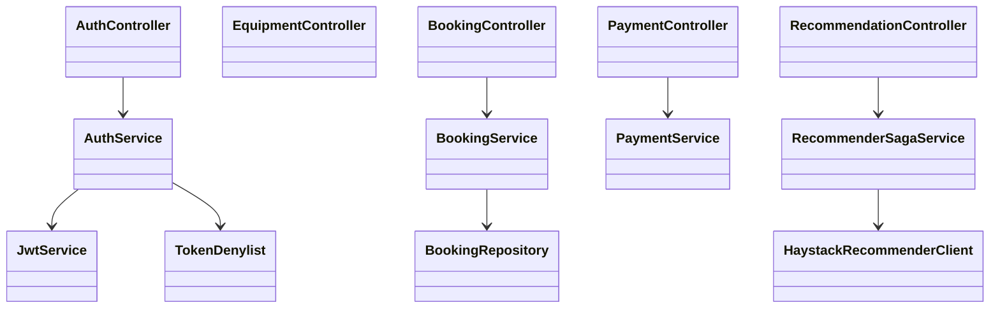

```plantuml
@startuml class-spring
package controller {
  class AuthController
  class BookingController
  class RecommendationController
}
package service {
  class AuthService
  class BookingService
  class RecommenderSagaService
}
package client {
  class HaystackRecommenderClient
}
package security {
  class JwtService
  class TokenDenylist
}
AuthController --> AuthService
AuthService --> JwtService
BookingController --> BookingService
RecommendationController --> RecommenderSagaService
RecommenderSagaService --> HaystackRecommenderClient
@enduml
```

### 10.2 Android

```mermaid
classDiagram
  class HeavyRentalApp
  class AppViewModel
  class AuthRepository
  class BookingRepository
  class MockDataRepository
  class TokenSession
  HeavyRentalApp --> AppViewModel
  AppViewModel --> AuthRepository
  AppViewModel --> BookingRepository
  AppViewModel --> MockDataRepository
  AuthRepository --> TokenSession
  BookingRepository --> HeavyRentalApiService
  class HeavyRentalApiService
```

### 10.3 Haystack pipeline (high-level)

```mermaid
classDiagram
  class FastAPI_App
  class IngestService
  class RecommendationService
  class KnowledgeQueryService
  class DocumentStoreFactory
  class FleetBackend
  FastAPI_App --> IngestService : Call 1
  FastAPI_App --> RecommendationService : Call 2
  FastAPI_App --> KnowledgeQueryService : Call 3
  IngestService --> DocumentStoreFactory
  RecommendationService --> FleetBackend
```

### 10.4 React portal (high-level)

```mermaid
classDiagram
  class App
  class CustomerOnboarding
  class AdminDashboard
  class ApiClient
  class AuthContext
  App --> CustomerOnboarding
  App --> AdminDashboard
  App --> AuthContext
  CustomerOnboarding --> ApiClient
  AdminDashboard --> ApiClient
  AuthContext --> ApiClient
```

---

## 11. State machines

### 11.1 Booking

```mermaid
stateDiagram-v2
  [*] --> PENDING_DEPOSIT : POST /api/bookings
  PENDING_DEPOSIT --> PENDING_CONFIRMED : deposit webhook success
  PENDING_CONFIRMED --> CONFIRMED : balance / confirm
  CONFIRMED --> MOBILISED : PATCH deliveries
  MOBILISED --> COMPLETED : PATCH returns
  PENDING_DEPOSIT --> CANCELLED
  PENDING_CONFIRMED --> CANCELLED
```

```plantuml
@startuml state-booking
[*] --> PENDING_DEPOSIT
PENDING_DEPOSIT --> PENDING_CONFIRMED : deposit succeeded
PENDING_CONFIRMED --> CONFIRMED
CONFIRMED --> MOBILISED : deliver
MOBILISED --> COMPLETED : return
PENDING_DEPOSIT --> CANCELLED
@enduml
```

### 11.2 Payment and rental plan

```mermaid
stateDiagram-v2
  [*] --> PENDING : PaymentIntent created
  PENDING --> SUCCESS : payment_intent.succeeded
  PENDING --> FAIL : payment_intent.payment_failed
```

```mermaid
stateDiagram-v2
  [*] --> DRAFT : POST /api/rentalPlans
  DRAFT --> SAVED
  DRAFT --> QUOTED : POST .../quote
  SAVED --> QUOTED
  QUOTED --> CONVERTED : booking created
```

---

## 12. Activity and deployment

### 12.1 Recommender saga (activity)

```mermaid
flowchart TD
  A[Portal submits project-spec] --> B[Spring Call 1 ingest]
  B --> C{Call 1 OK?}
  C -->|no| Z[Map 502/503/504; do not invent catalog]
  C -->|yes| D[Persist AIRecommendation]
  D --> E[Spring Call 2 quote]
  E --> F{Call 2 OK?}
  F -->|no| G[Keep session; do not re-ingest]
  F -->|yes| H[Return quote to portal]
  H --> I[Optional Call 3 Q&A]
```

### 12.2 AWS Academy estate

```mermaid
flowchart TB
  browser[Browser] --> igw[IGW]
  igw --> albP[Public ALB portal :80]
  albP --> asgP[asg-portal x2 AZs]
  asgP --> albR[Internal ALB REST :8080]
  albR --> asgR[asg-rest x2]
  asgR --> rdsSor[RDS heavy_rental Multi-AZ]
  asgR --> albH[Internal ALB Haystack :8000]
  albH --> asgH[asg-haystack x2]
  asgH --> rdsHs[RDS haystack Multi-AZ]
  asgH --> nlbN[Internal NLB Bolt :7687]
  nlbN --> n4j[asg-neo4j x2]
```

PlantUML: [`docs/diagrams/deployment-academy.puml`](docs/diagrams/deployment-academy.puml).

```plantuml
@startuml deployment-academy
node "Public AZ" {
  [NAT GW] as NAT
  [Portal ALB] as PALB
}
node "App AZ" {
  [asg-portal] as P
  [asg-rest] as R
  [asg-haystack] as H
  [REST ALB] as RALB
  [Haystack ALB] as HALB
}
node "Data AZ" {
  database "RDS SoR" as RDS
  database "RDS Haystack" as RDSH
  [asg-neo4j] as N
  [Bolt NLB] as NLB
}
[Browser] --> PALB
PALB --> P
P --> RALB
RALB --> R
R --> RDS
R --> HALB
HALB --> H
H --> RDSH
H --> NLB
NLB --> N
@enduml
```

**Terraform** creates VPC, NAT Gateways, ASGs, ALBs, RDS, NLB, secret shells. **Ansible** only configures existing guests (Docker, `.env` from Secrets Manager, compose). IAM on Academy: `LabInstanceProfile` → `LabRole` (no IAM create).

### 12.3 CI/CD

```mermaid
flowchart LR
  PR[Pull request] --> FF[fast-feedback]
  PR --> CI[full CI]
  tag[Release tag] --> REL[release workflow]
  REL --> GHCR[GHCR / ECR image]
  GHCR --> ACD[Academy CD caller]
  ACD --> ANS[Ansible --limit app]
```

Pipeline repo workflows include `mobile-ci` / `mobile-fast-feedback` / `mobile-release`, `rest-api-*`, `web-portal-*`, and `portal-cd-academy-caller`. Day-two single-image rolls do **not** run Terraform. First compose of all three apps on a new estate: infra `action=deploy-projects` after `apply`.

---

## 13. Design-only and known gaps

| Item | Status |
|------|--------|
| `POST /api/pricing/estimate` | OpenSpec change; not implemented |
| Haystack-backed `PricingClient` for rental-plan quote | Still `DefaultPricingClient` in Spring |
| Real Depot resource | `/api/depots` returns `[]` |
| Haystack default production `pgvector` + agent graph | Config-ready; defaults often stub/fake for tests |
| Mobile Room / offline queue / MFA | Out of scope v1 |
| Causal Neo4j cluster | Two ASG instances behind NLB; not a causal cluster |
| Paid AWS OIDC estate | Later than Vocareum Academy lab |

Do not treat design docs as as-built API behavior.

---

## 14. Traceability

| Concern | OpenSpec (this pack) | OpenSPDD | ADR |
|---------|----------------------|----------|-----|
| Platform / submission | [`openspec/specs/platform-overview`](openspec/specs/platform-overview/spec.md) | [`spdd/prompt/platform-overview.md`](spdd/prompt/platform-overview.md) | [`adr/`](adr/) |
| Mobile | [`repositories/heavy-rental-mobile`](repositories/heavy-rental-mobile/) | same `spdd/` | same `adr/` |
| Spring REST | [`repositories/heavy-rental-spring-rest-api`](repositories/heavy-rental-spring-rest-api/) | | |
| Web portal | [`repositories/heavy-rental-react-web-portal`](repositories/heavy-rental-react-web-portal/) | | |
| Haystack | [`repositories/haystack-fast-api`](repositories/haystack-fast-api/) | | |
| DevContainers | [`repositories/heavy-rental-devcontainer-configuration`](repositories/heavy-rental-devcontainer-configuration/) | | |
| Pipeline | [`repositories/heavy-rental-project-pipeline-development`](repositories/heavy-rental-project-pipeline-development/) | | |
| Infra | [`repositories/heavy-rental-project-instructure-and-cloud-deploy`](repositories/heavy-rental-project-instructure-and-cloud-deploy/) | | |

Upstream as-built HTTP detail: [Spring DOCUMENTATION.md](https://github.com/Heavy-Rental/heavy-rental-spring-rest-api/blob/develop/DOCUMENTATION.md). DevContainer narrative: [ARCHITECTURE.md](https://github.com/Heavy-Rental/heavy-rental-devcontainer-configuration/blob/develop/ARCHITECTURE.md). Academy layout: [infra ARCHITECTURE.md](https://github.com/Heavy-Rental/heavy-rental-project-instructure-and-cloud-deploy/blob/develop/docs/ARCHITECTURE.md).

---

*Generated as as-built project documentation for Heavy Rental submission. Prefer OpenSpec contracts when implementing or changing behavior.*
