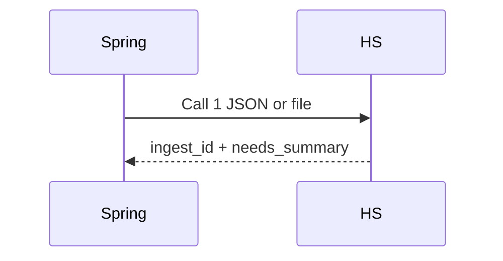

# call1-ingest Specification

## Purpose

Call 1 SHALL ingest project text or file and return a lean summary plus `ingest_id`.

## Requirements

### Requirement: Submit project specification
`POST /internal/v1/recommendations/submitprojectspecification` SHALL accept JSON or multipart and return `ingest_id`, `user_requirement_summary`, `needs_summary[]`, optional budget/dates, and `warnings`.

#### Scenario: Correlation
- **THEN** `X-Correlation-Id` is accepted or generated

