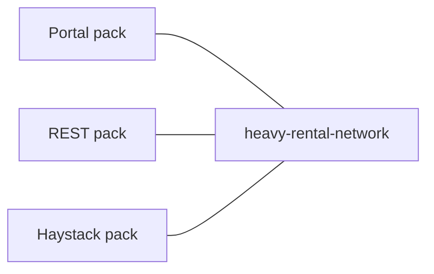

# platform-devcontainers Specification

## Purpose

Local development SHALL run three independent Compose packs on an external Docker network.

## Requirements

### Requirement: External network
All packs SHALL attach to `heavy-rental-network`. No pack SHALL create that network.

#### Scenario: Missing network
- **WHEN** the network does not exist
- **THEN** Compose fails until `docker network create heavy-rental-network`

