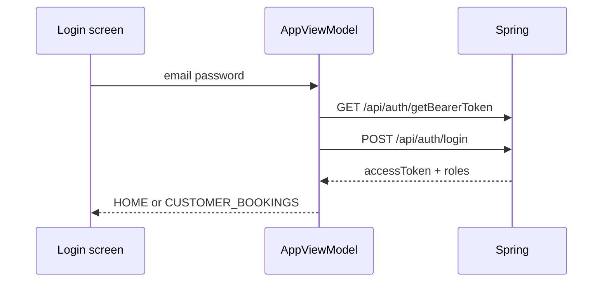

# auth-login Specification

## Purpose

The Android app SHALL authenticate via the Spring interim-then-access JWT handshake and route the session by `roles`.

## Requirements

### Requirement: Interim then access login
The app SHALL obtain an interim JWT, POST email/password to `/api/auth/login` with that bearer, and store the access token in memory.

#### Scenario: Successful staff login
- **GIVEN** Spring is reachable and `admin@localhost` / `admin1234` is valid
- **WHEN** the user submits the login screen
- **THEN** the app holds an access JWT and opens the staff Home screen

### Requirement: Role routing
The app SHALL send `ROLE_USER` sessions to Customer Bookings and staff roles to Home / Deliveries / Returns.

#### Scenario: Customer landing
- **GIVEN** the access token `roles` claim contains `ROLE_USER` and not admin/staff
- **WHEN** login succeeds
- **THEN** the user cannot open mobilise/complete affordances

