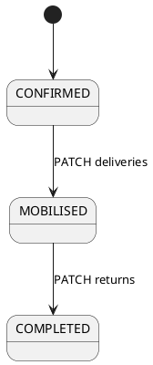

# deliveries-returns Specification

## Purpose

Operators SHALL mobilise confirmed deliveries and complete mobilised returns for **today** only.

## Requirements

### Requirement: Delivery list and mobilise
Deliveries SHALL be `startDate == today` and status in `{CONFIRMED, MOBILISED}`. Mobilise SHALL PATCH `CONFIRMED → MOBILISED` only.

#### Scenario: Invalid transition rejected
- **GIVEN** a booking already `MOBILISED`
- **WHEN** the operator requests mobilise
- **THEN** the client does not treat a non-CONFIRMED row as a legal mobilise (server returns 400 if called)

### Requirement: Return list and complete
Returns SHALL be `endDate == today` and status in `{MOBILISED, COMPLETED}`. Complete SHALL PATCH `MOBILISED → COMPLETED`.

#### Scenario: Maps
- **WHEN** the operator opens a row with a site address
- **THEN** the app can open the location in maps

