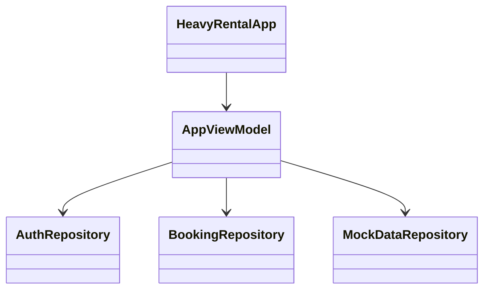

# REASONS Canvas — heavy-rental-mobile

## R — Requirements
Staff: login, today counts, mobilise, complete. Customer: read-only bookings.

## E — Entities

## A — Approach
Single `AppViewModel` + `StateFlow`. Retrofit OpenAPI. Default base URL Spring `:8080` via `10.0.2.2`.

## S — Structure
UI screens → ViewModel → repositories → Retrofit / seed.

## O — Operations
1. Login handshake. 2. Load deliveries+returns. 3. PATCH legal transitions. 4. Show banner on failure.

## N — Norms
Package `com.heavyrental`. Spec conflict order: product → domain → OpenAPI → code.

## S — Safeguards
- MUST NOT implement MFA/biometric in v1.
- MUST NOT give customers PATCH status controls.
- MUST NOT assume Room persistence.
- MUST NOT skip the interim JWT step when talking to real Spring.
