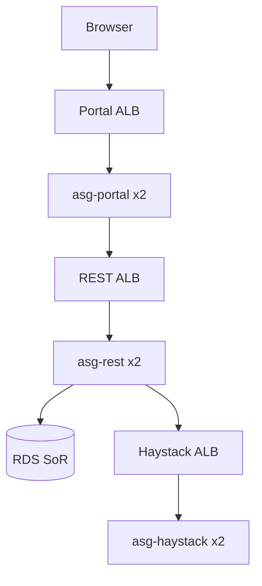

# two-az-ha Specification

## Purpose

The estate SHALL span two AZs with same-AZ NAT egress and Multi-AZ RDS.

## Requirements

### Requirement: Counts
Portal, REST, Haystack, and Neo4j ASGs SHALL have desired 2 (one per app/data AZ). NAT SHALL be two Gateways, not a NAT instance.

#### Scenario: Traffic
- **THEN** Browser → public portal ALB → portal → internal REST ALB → REST → SoR RDS, and REST → Haystack ALB → Haystack RDS + Bolt NLB

