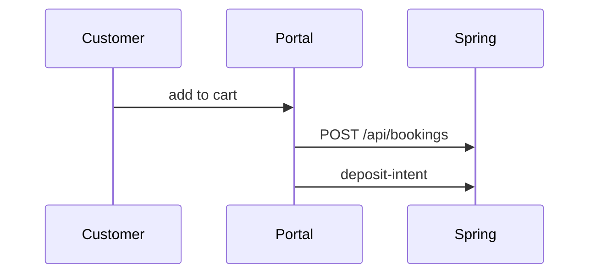

# customer-booking-checkout Specification

## Purpose

Customers SHALL onboard, pick dates, maintain a cart, and complete checkout against Spring.

## Requirements

### Requirement: Postal and dates
Checkout SHALL send `siteAddress` ending in a 6-digit postal code and valid date ranges expected by Spring.

#### Scenario: Validation
- **WHEN** dates are invalid
- **THEN** the UI blocks submit before or surfaces API `validation_failed`

