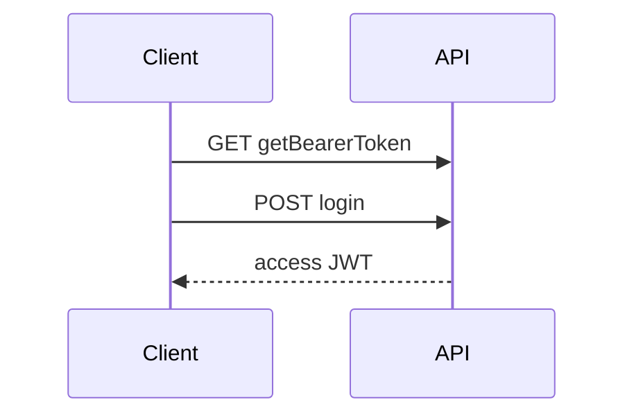

# auth-jwt Specification

## Purpose

The API SHALL mint an interim JWT for login, then an access JWT bound to the user email and roles.

## Requirements

### Requirement: Public interim token
`GET /api/auth/getBearerToken` SHALL return `text/plain` interim JWT with `tokenType=interim` and `ROLE_INTERIM`.

#### Scenario: Login requires interim
- **WHEN** `POST /api/auth/login` is called without a valid interim bearer
- **THEN** the API rejects the call (401/403)

### Requirement: Login issues access and denylists interim
On successful authentication the API SHALL return `accessToken`, denylist the interim `jti`, and set `sub` to the email.

#### Scenario: Logout
- **WHEN** `POST /api/auth/logout` is called with an access JWT
- **THEN** that access `jti` is denylisted until original expiry

