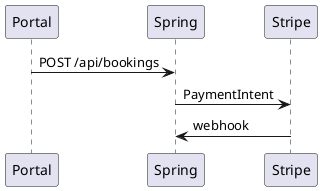

# booking-payments Specification

## Purpose

Bookings SHALL start at `PENDING_DEPOSIT` with a 30% deposit and collect payment via Stripe PaymentIntent + webhook.

## Requirements

### Requirement: Create booking
`POST /api/bookings` SHALL price lines with `days = max(1, DAYS.between(start, end))`, set `depositAmount = 0.30 * total`, reject overlapping ACTIVE assets with 409, and enforce postal `siteAddress`.

#### Scenario: Overlap
- **GIVEN** asset 1 is CONFIRMED for the same dates
- **WHEN** another booking includes asset 1
- **THEN** HTTP 409 `conflict`

### Requirement: Deposit intent and webhook
`POST /api/payments/deposit-intent` SHALL create a Stripe PaymentIntent in `sgd` with `setup_future_usage=off_session`. `POST /api/payments/webhook` SHALL verify `Stripe-Signature` and update Payment / booking status. Webhook SHALL NOT require JWT.

#### Scenario: Duplicate deposit
- **WHEN** a non-failed deposit already exists
- **THEN** deposit-intent returns 409

### Requirement: Balance scheduler
A daily job at 02:00 Asia/Singapore SHALL charge remaining balance off-session for `PENDING_CONFIRMED` bookings whose `startDate` is tomorrow, each booking in its own transaction.

