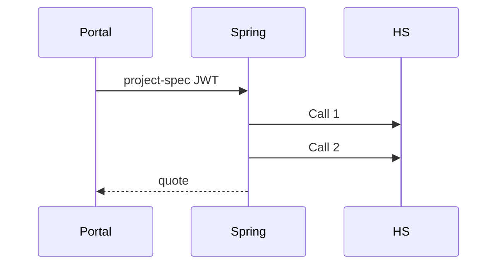

# haystack-recommender Specification

## Purpose

Spring SHALL orchestrate Haystack Call 1 then Call 2 for project-spec, and Call 3 for knowledge Q&A, without exposing Haystack to the browser.

## Requirements

### Requirement: Dual-hop submit
`POST /api/recommendations/project-spec` SHALL derive `user_id` from the JWT, call ingest then quote, persist `AIRecommendation`, and return `recommendationId` plus quote fields. Controllers SHALL NOT call Haystack HTTP.

#### Scenario: Call 2 fails after Call 1
- **THEN** the session row is kept and ingest is not repeated
- **AND** the API SHALL NOT invent equipment or rates

### Requirement: Knowledge query is Call 3 only
`POST /api/recommendations/{id}/knowledge-query` SHALL load the owner session and call Haystack query only.

#### Scenario: GET session
- **WHEN** `GET /api/recommendations/{id}`
- **THEN** Spring reads the database and does not call Haystack

### Requirement: Resilience mapping
Timeouts, circuit breaker, and bulkhead SHALL map to `504 recommender_timeout`, `503 recommender_unavailable`, or `502 recommender_upstream_error` as configured.

