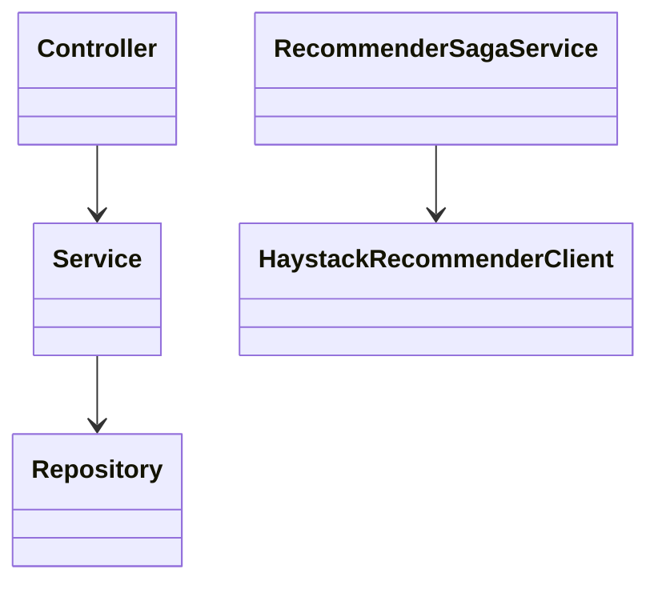

# REASONS Canvas — Spring REST API

## R — Requirements
Public HTTP for portal and mobile. Own identity, fleet, plans, bookings, payments, ops, admin, recommender orchestration.

## E — Entities
User, AssetCategory, Asset, AssetImage, RentalPlan, RentalPlanRecord, Booking, BookingItem, Payment, DeliveryRecord, ReturnRecord, AIRecommendation, RecommendationItem.

## A — Approach
Stateless JWT resource server. Stripe PaymentIntents + webhook. Resilience4j around Haystack. Hibernate update locally; Flyway in prod.

## S — Structure
`controller` → `service` → `repository` / `client.haystack` / `security`.

## O — Operations
1. Auth handshake. 2. Equipment. 3. Plan quote. 4. Booking + deposit-intent. 5. Webhook. 6. Delivery/return PATCH. 7. Dual-hop recommend.

## N — Norms
Error body `{error, message}`. CORS configured origins only. Currency `sgd`.

## S — Safeguards
- MUST NOT call Haystack from a controller.
- MUST NOT BCrypt-encode the login password before `AuthenticationManager`.
- MUST NOT invent quote lines on Haystack failure.
- MUST NOT enable wildcard CORS.
- MUST NOT treat plan day-count and booking day-count as the same formula.
