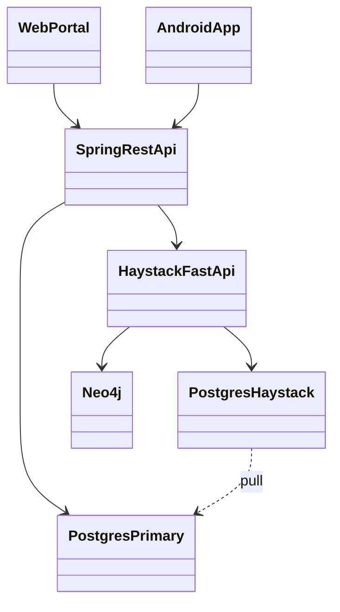

# REASONS Canvas — platform overview

## R — Requirements
- Document all seven Git repositories for project submission.
- Preserve as-built trust: portal/mobile → Spring → (optional) Haystack.
- Provide DevContainer QuickStart for the three local packs.

## E — Entities

## A — Approach
- One `DOCUMENTATION.md` plus per-repo OpenSpec/SPDD/ADR.
- Dual diagram languages; GitHub renders Mermaid.
- Synthesize; do not vendor application source.

## S — Structure
- Root: README (template structure), DOCUMENTATION, QUICKSTART, openspec, spdd, adr.
- `repositories/<repo>/` mirrors the three-layer model per Git project.

## O — Operations
1. Update `DOCUMENTATION.md` when as-built HTTP or topology changes.
2. Archive OpenSpec deltas into `openspec/specs/`.
3. Add ADRs for durable decisions only.
4. Sync REASONS canvases after implementation drift (`/spdd-sync` equivalent).

## N — Norms
- RFC 2119 SHALL/MUST.
- Table names follow Spring as-built (`assets`, `bookings`) except when documenting the D0 merge allowlist.
- Link upstream repos on `develop`.

## S — Safeguards
- MUST NOT document the portal calling Haystack directly.
- MUST NOT treat Haystack Postgres as product SoT.
- MUST NOT mix design-only endpoints into as-built route tables without a label.
- MUST NOT edit accepted ADRs in place.
- MUST NOT invent equipment ids, rates, or budgets in examples that claim to be live SQL.
